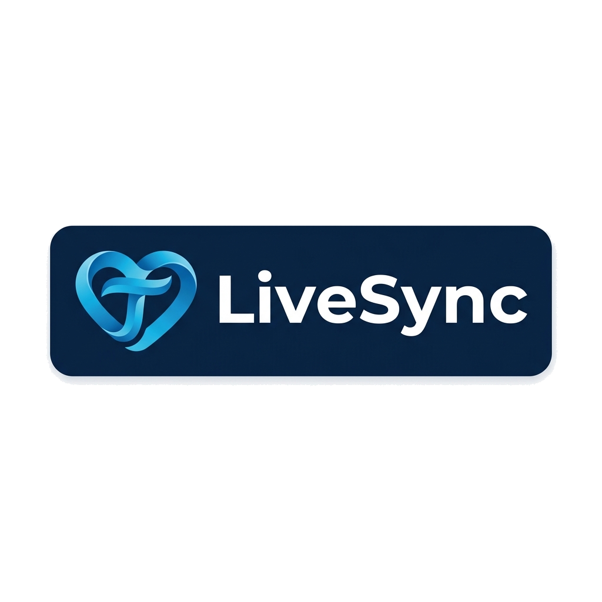

<p align="center">
  
</p>

<p align="center">
  <b>Real-Time Family Safety, GPS Tracking & Digital Wellbeing</b>
</p>

<p align="center">
  
  
  
  
  
</p>

LiveSync is a premium React Native application for secure real-time location sharing, family safety, and smart device management. Its modular architecture makes it suitable for family tracking, school transportation, employee location monitoring, and other location-based solutions.


<!-- ---

## Privacy & Security

LiveSync is designed for authorized family use only.

Location sharing requires explicit permission from the tracked device.

All communication should be encrypted using HTTPS and secure authentication.

Parents retain full control over linked devices and permissions.


--- -->

## 🚀 Categorized Features

### 1. Live Tracking & Locator
* **Real-time Map Preview**: Visual feedback on coordinates coupled with status overlays for Speed, Battery, and Network status. Uses [map.png](file:///Volumes/Untitled/Innspark/Self%20Project/VTSSchool/TraqinnParent/src/assets/image/map.png) coordinates.
* **Dynamic Switcher**: Toggle tracking views seamlessly between multiple children (Liam and Sophia).
* **Trip Logs**: Replay routes taken and view travel history distance/duration metrics.

### 2. Safety & Phone Management
* **Safe Zone Geofencing**: Add custom geofences with a live visual range circle that expands and contracts dynamically in real time.
* **App Controls**: Remotely block social media apps, set daily screen limits, or toggle Homework Focus Mode.

### 3. Smart Assistant & Reports
* **SyncBot AI Assistant**: Chat helper chatbot character styled with transparent, matching deep-navy branding.
* **Weekly Commute Analytics**: Commute distance bar charts and Safe Zone time distribution indicators.

---

## Environment Variables

Create a `.env` file.

```env
GOOGLE_MAPS_API_KEY=
API_URL=
SOCKET_URL=
```

---

## 🔑 Test Login Credentials

To bypass the verification login flow during local development, use these credentials on the Login screen:
* **Phone Number**: `1234567890`
* **Verification OTP**: `1234`

---

## 🏁 Getting Started

### Step 1: Install Dependencies
Run from the root of your project:
```sh
npm install
```

### Step 2: iOS CocoaPods Installation (Mac Only)
Navigate to the `ios` directory and run:
```sh
cd ios && pod install && cd ..
```

### Step 3: Run Metro Bundler
Start the Metro server:
```sh
npm start
```

### Step 4: Run the Application
Open a new terminal window and run:

**iOS Simulator:**
```sh
npm run ios
```

**Android Emulator:**
```sh
npm run android
```

---

## 🎨 Design & Theme Mappings

### Typography
The application uses the **Poppins** typeface to establish a modern, clean, and premium visual identity. The font weights are globally mapped inside the project theme directory (`src/theme/Typography.js`):
* `Poppins-Light` — Used for small body labels or muted secondary stats.
* `Poppins-Regular` — General body copy and text inputs.
* `Poppins-Medium` — Default button actions, status indicators, and dropdown labels.
* `Poppins-Bold` — Primary headers, child avatar banners, and main statistic values.

### Frosted Glassmorphism
Premium glassmorphic card styling is implemented dynamically across both themes to create depth:
* **Light Theme**: Overlays use solid `#FFFFFF` or translucent `#EFF4FA` backing with thin border separators to keep the interface feeling clean and polished.
* **Dark Theme**: Uses semi-translucent slate backdrops (`rgba(30, 41, 59, 0.85)`) coupled with light border highlights (`rgba(255, 255, 255, 0.15)`) to create a floating frosted glass effect.

---

## Contributing

Pull requests are welcome.

For major changes, please open an issue first to discuss your ideas.

---

## License

This project is licensed under the MIT License.
